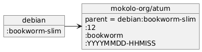

# Docker image mokolo-org/atum:bookworm

Base Docker image based on debian:bookworm:

- Latest updates after building
- With locales
- Timezone Europe/Amsterdam

## Name

Atum is the Egyptian creator god, the first god in the Heliopolitan ennead.
In Wikipedia there's a lemma for [Atum](https://en.wikipedia.org/wiki/Atum)

## Inheritance

